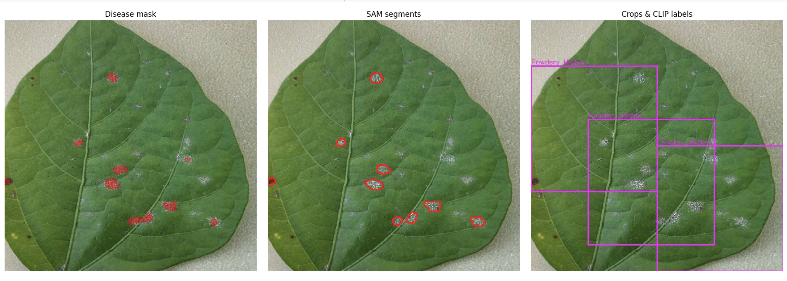
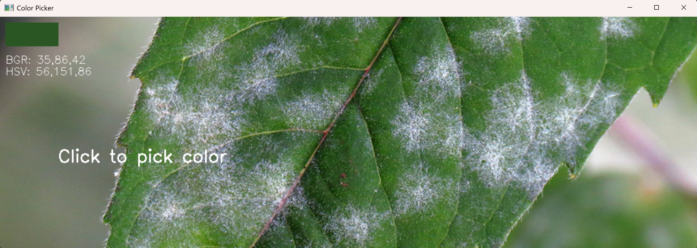

# Disease Detection in Plant Leaves
The complete code and instructions for detecting plant diseases. 

## Description
Gharsa's Eye is a project that utilizes a three step pipeline that masks, detects, and classifies plant diseases as shown below:

<p align="center">
  
</p>

The project comprises of a notebook utilizing OpenCV for masking possibly diseased areas, a notebook with a full pipeline of detecting to classifying diseases, and an HSV color picker to enable the adaptation of the project to more plant types. 


A full walkthrough of the project is available [here](https://abodeza.github.io/projects/gharsa/).

See [here](https://github.com/abodeza/clip-ViT-B-32-leaf-disease) the fine-tuning process of OpenAI's model (CLIP) on plant diseases.

This is a supplementary part of Gharsa, a plant growing companion aimed at novice plant lovers found [here](https://github.com/abodeza/Gharsa/tree/master).

### Color Picker demo
Below is an example of using the color picker tool.
<p align="center">
  
</p>


## Getting Started

### Prerequisites

* Python 3.10+ recommended
* Required libraries (listed in requirements.txt)

### Installation

```bash
# Clone the repository
git clone https://github.com/abodeza/plant_disease_detection.git

# Navigate to project directory
cd plant_disease_detection

# Create and activate virtual environment (optional but recommended)
python -m venv venv
source venv/bin/activate  # On Mac: venv\Scripts\activate

# Install dependencies
pip install -r requirements.txt
```


### Running the Application

The code provider can be ran on Google Colab or locally and is provided in a jupyter notebook format for ease of personalization. 

## Project Structure

The repo constist of mostly notebooks and a script.
```
plant_disease_detection/
├── README.md
├── requirements.txt                # Dependencies
├── notebooks/                      # Data models
│   ├── filtering_diseases.ipynb    # Disease masking
│   └── gharsa_eye_v1.0.ipynb       # Full pipeline
├── scripts/                        
│   ├── color_picker.py             # Used to find the target pixel color in an image in BGR and HSV formats.
├── assests/                        # Images for the README.md                        
│   ├── ...
├── test_imgs/                      # Images for testing the pipeline
│   ├── ...
```
## Contributing

Guidelines for contributors:
1. Fork the repository
2. Create a feature branch (`git checkout -b feature/amazing-feature`)
3. Commit changes (`git commit -m 'Add amazing feature'`)
4. Push to branch (`git push origin feature/amazing-feature`)
5. Open a Pull Request

## Author

Abdullah Alzahrani
- Email: [abdullah.alzahrani.p@gmail.com](mailto:abdullah.alzahrani.p@gmail.com)
- GitHub: [@abodeza](https://github.com/abodeza)
- LinkedIn: [a-a-alzahrani](https://linkedin.com/in/a-a-alzahrani)
